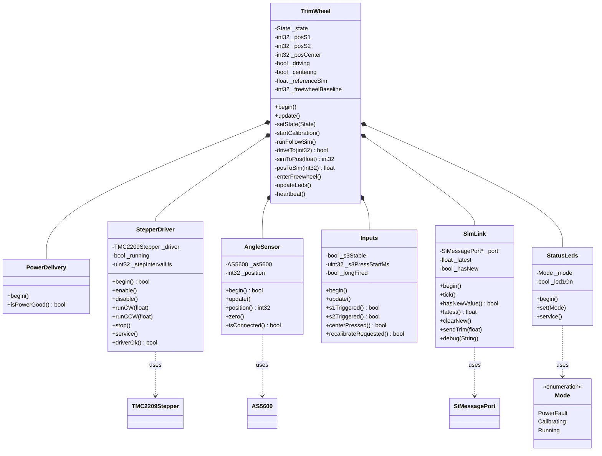
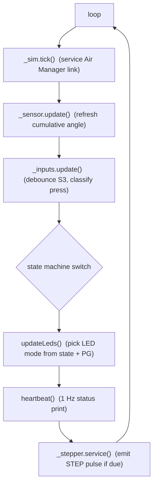
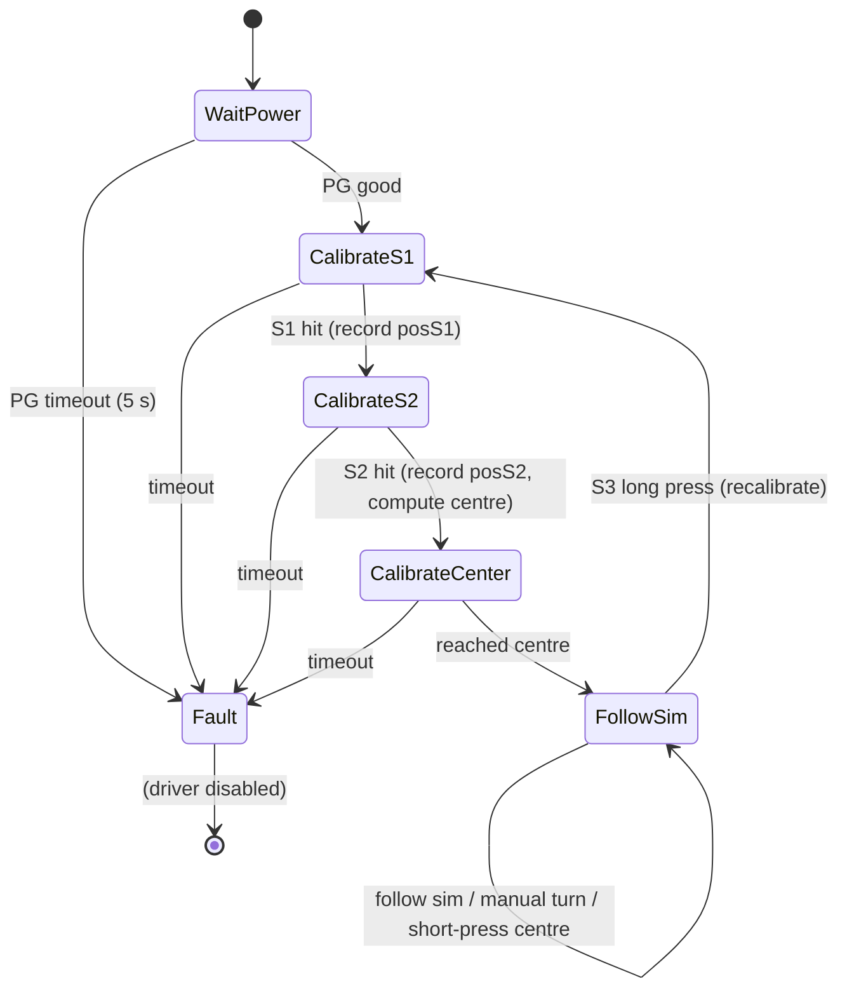

# TrimWheel Firmware — Architecture

Firmware for the Air Manager / MSFS Cessna‑172 elevator‑trim wheel, running on an
**ESP32‑S3 PD‑Stepper** board (PlatformIO + Arduino framework).

The firmware drives a TMC2209 stepper so the trim wheel **follows the simulator's
trim position**, lets the user **turn the wheel by hand** (relaying the new
position back to the sim), and **centres** the wheel on demand. A USB‑PD sink is
configured to 5 V before the motor is ever energised, and two on‑board LEDs report
status.

---

## 1. Design at a glance

- **One class per peripheral.** Each hardware block has a small driver class with a
  `begin()` + per‑loop service method. `TrimWheel` is the only stateful coordinator.
- **Non‑blocking.** `loop()` runs continuously; motion, debouncing, blinking and
  heartbeat are all `millis()`/`micros()`‑timed. The only short blocking call is the
  ~3 µs STEP pulse width.
- **Closed‑loop on the magnetic encoder.** Positioning uses the AS5600 multi‑turn
  reading as feedback rather than counting steps, so it tolerates the multi‑turn
  gearing between motor and wheel without knowing the exact ratio.
- **Three‑point sim↔position map.** The Cessna‑172 trim scale is mapped to encoder
  counts using the three calibration anchors (Nose Down / centre / Nose Up) as a
  piecewise‑linear curve.

---

## 2. Hardware / pin map

All pins and tuning values live in [`include/Config.h`](../include/Config.h).

| Subsystem | Signals (GPIO) | Notes |
|-----------|----------------|-------|
| USB‑PD (CH224K) | PG `15`, CFG1 `38`, CFG2 `48`, CFG3 `47` | Request 5 V; PG **LOW = power good** |
| TMC2209 | EN `21`, STEP `5`, DIR `6`, MS1 `1`, MS2 `2`, SPREAD `7`, TX `17`, RX `18`, DIAG `16`, INDEX `11` | UART control on `Serial1`, slave addr 0 |
| AS5600 | SDA `8`, SCL `9` | I²C @ 400 kHz, 4096 counts/rev |
| Endstops / button | S1 `35` (CW/Nose‑Down), S2 `36` (CCW/Nose‑Up), S3 `37` (centre) | Active‑low, internal pull‑ups |
| Status LEDs | LED1 `12` (status/blink), LED2 `10` (ready/PWM) | LED2 via LEDC PWM |
| Air Manager | TX `13`, RX `14` | SiMessagePort on `Serial2` |

### Serial port allocation

| Port | Use |
|------|-----|
| `Serial`  | Debug console (UART0) |
| `Serial1` | TMC2209 UART (pins 17/18) |
| `Serial2` | Air Manager / SiMessagePort (pins 13/14) |

---

## 3. Module responsibilities

| Module | File(s) | Responsibility |
|--------|---------|----------------|
| `PowerDelivery` | `PowerDelivery.{h,cpp}` | Drive CFG pins to request 5 V; report `isPowerGood()` from PG. |
| `StepperDriver` | `StepperDriver.{h,cpp}` | Configure TMC2209 over UART; non‑blocking velocity step generation; enable / freewheel. |
| `AngleSensor` | `AngleSensor.{h,cpp}` | AS5600 wrapper; cached **multi‑turn cumulative** position. |
| `Inputs` | `Inputs.{h,cpp}` | Read S1/S2 limits; debounce S3 and classify **short vs long press**. |
| `SimLink` | `SimLink.{h,cpp}` | SiMessagePort wrapper; cache inbound trim, send outbound trim. |
| `StatusLeds` | `StatusLeds.{h,cpp}` | Map a status `Mode` to the two LEDs (blink / PWM brightness). |
| `TrimWheel` | `TrimWheel.{h,cpp}` | Top‑level state machine tying everything together. |
| `main` | `main.cpp` | `setup()` → `TrimWheel::begin()`, `loop()` → `TrimWheel::update()`. |

---

## 4. Class diagram



`TrimWheel` **owns** (composition) one instance of every driver. The drivers do not
know about each other or about `TrimWheel`; all coordination is one‑directional from
the controller.

---

## 5. The control loop

`loop()` calls `TrimWheel::update()` every iteration. The fixed per‑loop sequence is:



Because `_stepper.service()` emits at most one STEP pulse per `loop()` pass, the
achievable top step‑rate is bounded by the loop frequency (the AS5600 I²C read is the
dominant cost). The configured speeds are chosen with margin below that bound.

---

## 6. State machine



- **WaitPower** — CFG pins request 5 V; the TMC2209 stays **disabled** until
  `isPowerGood()`. A 5 s timeout drops to `Fault`.
- **CalibrateS1** — run **CW** at `CALIB_SPEED_SPS` until S1 (Nose Down); record
  `posS1`.
- **CalibrateS2** — run **CCW** until S2 (Nose Up); record `posS2`. The signed travel
  `posS2 − posS1` defines the usable range and the direction sense.
- **CalibrateCenter** — closed‑loop drive back to `posCenter = posS1 + (posS2−posS1)/2`.
- **FollowSim** — normal operation (Section 7).
- **Fault** — driver disabled; LEDs show the power‑fault pattern.

Each phase has a `CALIB_PHASE_TIMEOUT_MS` watchdog so a missing endstop can’t hang
the machine.

---

## 7. Normal operation (FollowSim)

Each loop in `FollowSim`, in priority order:

1. **S3 long press** (`recalibrateRequested()`) → `startCalibration()` (re‑run the
   whole sequence).
2. **S3 short press** (`centerPressed()`) → start a commanded move to `posCenter`
   (`_centering = true`).
3. **New sim value** (`hasNewValue()`) that differs from `_referenceSim` by more than
   `SIM_FOLLOW_DEADBAND` → start a follow move.
4. **If driving** → `driveTo(target)` closed‑loop; on arrival, freewheel and update
   the reference (and, when centring, send the centre value to the sim).
5. **If idle / freewheeling** → watch for a manual turn and relay it.

### Driving (closed loop) — `driveTo()`

```
error  = target − sensor.position()            // in encoder counts
if |error| ≤ POS_DEADBAND_COUNTS → stop, done
speed  = clamp(|error| · DRIVE_KP_SPS, DRIVE_MIN_SPS, DRIVE_MAX_SPS)
ccwIncreases = (posS2 > posS1)                  // learned during calibration
moveCCW      = (error > 0) == ccwIncreases
runCCW/​runCW(speed)
```

### Freewheel + manual turn

After reaching a target the driver is **disabled** (`enterFreewheel()`), so the coils
are open and the wheel turns freely. While freewheeling, if the position drifts from
`_freewheelBaseline` by more than `MANUAL_MOVE_COUNTS`, that is treated as a deliberate
manual turn: the position is converted to a sim value, sent via `sendTrim()`, and the
baseline + `_referenceSim` are advanced so further movement streams incrementally.

### Echo suppression

When we send a value to the sim (manual turn or centre), the sim echoes a matching
value back on the next frame. `_referenceSim` is set to the value we just sent, and
inbound values within `SIM_FOLLOW_DEADBAND` of `_referenceSim` are ignored — so the
wheel does not chase its own echo and oscillate.

---

## 8. Sim value ↔ position mapping

Calibration anchors (Cessna‑172 elevator trim, from `Config.h`):

| Point | Sim value | Encoder position |
|-------|-----------|------------------|
| Nose Down (S1, CW)  | `SIM_NOSE_DOWN = −0.86364` | `posS1` |
| Centre              | `SIM_CENTER   =  0.13636`  | `posCenter` |
| Nose Up (S2, CCW)   | `SIM_NOSE_UP  =  1.00000`  | `posS2` |

The centre sim value is **not** the numeric midpoint of the extremes, so a single
linear map would misplace the wheel. The map is therefore **piecewise‑linear across
the three anchors**:

- `simToPos(sim)` — clamp to `[NOSE_DOWN, NOSE_UP]`; interpolate on the lower segment
  (`NOSE_DOWN→CENTER` ⇒ `posS1→posCenter`) or upper segment
  (`CENTER→NOSE_UP` ⇒ `posCenter→posS2`).
- `posToSim(pos)` — compute the travel fraction `t = (pos−posS1)/(posS2−posS1)`
  (direction‑agnostic), pick the segment by comparing against the centre fraction, and
  interpolate the sim value. Result clamped to the valid range.

---

## 9. Status LEDs

`updateLeds()` derives a `StatusLeds::Mode` from PG and state:

| Condition | LED1 (GPIO12) | LED2 (GPIO10) |
|-----------|---------------|---------------|
| `!isPowerGood()` (incl. boot, or power loss) → **PowerFault** | blink fast (~80 ms) | off |
| Calibration phases / non‑power fault → **Calibrating** | blink slow (~400 ms) | off |
| `FollowSim` → **Running** | off | steady ~50 % (PWM) |

PG is checked **first**, so a power loss during operation reverts to the fault
indication regardless of the state‑machine state. LED2 brightness uses the ESP32 LEDC
peripheral (channel 0, 5 kHz, 8‑bit, duty 128).

---

## 10. S3 button gestures

`Inputs` debounces S3 (`SWITCH_DEBOUNCE_MS`) and classifies the hold:

- **Short press** — released before `SWITCH_LONG_PRESS_MS` (3 s) → `centerPressed()`.
- **Long press** — held ≥ 3 s → `recalibrateRequested()` fires **while still held**, so
  the action is immediate and the later release does **not** also trigger a centre
  (`_longFired` guard).

---

## 11. Air Manager protocol

Two message IDs (must match the Air Manager script):

| ID | Constant | Direction | Payload |
|----|----------|-----------|---------|
| 1 | `MSG_TRIM_FROM_SIM` | sim → firmware | current elevator trim (float; int also accepted) |
| 2 | `MSG_TRIM_TO_SIM`   | firmware → sim | trim position set by the wheel (manual turn / centre) |

`SimLink` routes the C callback through a singleton (`_self`) into `handleMessage()`,
which caches the latest value and raises `_hasNew`.

---

## 12. Key tuning constants (`Config.h`)

| Constant | Value | Meaning |
|----------|-------|---------|
| `TMC_MICROSTEPS` | 32 | Microstep resolution |
| `TMC_RMS_CURRENT_MA` | 800 | Motion current |
| `TMC_R_SENSE` | 0.10 Ω | Sense resistor (per coil) |
| `CALIB_SPEED_SPS` | 1200 | Endstop‑seek speed |
| `DRIVE_MAX_SPS` / `DRIVE_MIN_SPS` | 4800 / 300 | Follow‑move speed band |
| `DRIVE_KP_SPS` | 12 | Proportional gain (steps/s per count) |
| `POS_DEADBAND_COUNTS` | 12 | "On target" window |
| `MANUAL_MOVE_COUNTS` | 40 | Freewheel move that counts as manual |
| `SIM_FOLLOW_DEADBAND` | 0.01 | Sim change needed to command a move |
| `SWITCH_LONG_PRESS_MS` | 3000 | S3 long‑press threshold |

Speeds are expressed in **steps/s**; they are scaled to the microstep setting so that
physical RPM is independent of `TMC_MICROSTEPS`.

---

## 13. Build / flash / monitor

```bash
pio run                  # build
pio run -t upload        # flash (upload_port in platformio.ini)
pio device monitor       # 115200 baud debug console
```

The board connects over an RFC2217 serial bridge (`upload_port` / `monitor_port` in
`platformio.ini`). The firmware emits a 1 Hz `heartbeat()` status line
(`state / PG / position / referenceSim / driving`) so the board's state is observable
over the bridge even when it is otherwise idle.

### Items to verify against the physical board

- `TMC_DIR_CW_LEVEL` — DIR level that yields CW (Nose Down); flip if reversed.
- `LED_ACTIVE_HIGH`, `INPUT_ACTIVE_LOW`, `PD_POWER_GOOD_ACTIVE_LOW` — signal polarities.
- `MSG_TRIM_FROM_SIM` / `MSG_TRIM_TO_SIM` — must match the Air Manager script IDs.
